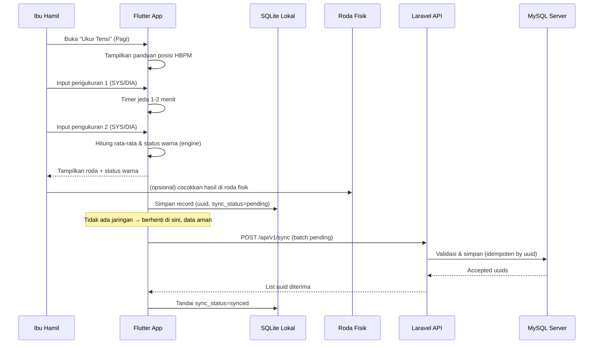
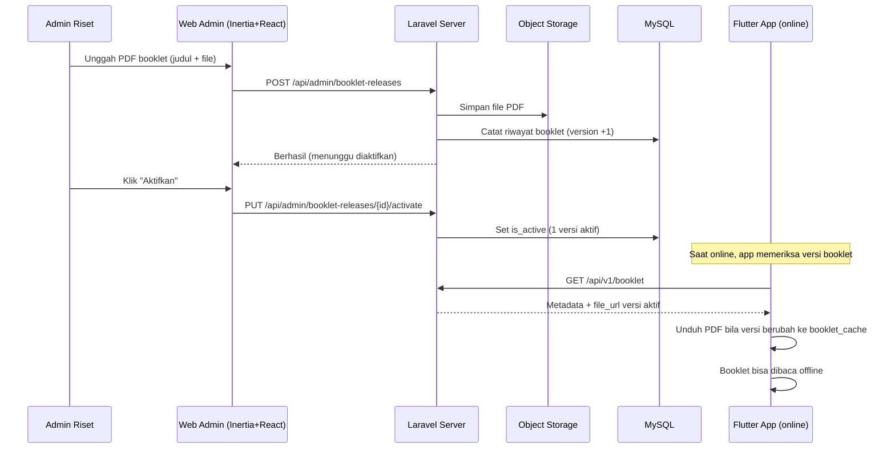

# ARCHITECTURE.md: ROTASI

## Ringkasan Sistem

ROTASI adalah sistem hibrid pemantauan mandiri tekanan darah dengan **aplikasi Android (Flutter) offline-first** sebagai produk utama, didampingi roda fisik ROTASI dan booklet cetak. Backend berupa **aplikasi monolitik Laravel** yang melayani dua jalur sekaligus: **web admin** (Laravel + Inertia.js + React) untuk manajemen booklet/rilis, dan **API sinkronisasi mobile** (JSON + Sanctum token). Aplikasi mobile menyimpan seluruh data di **SQLite lokal** dan menyinkronkan secara idempoten saat online. PDF booklet diunggah administrator dan disimpan di **object storage (S3-compatible)**; distribusi APK dilakukan **langsung dari VPS** (URL unduhan), bukan Play Store maupun Google Drive (diblokir). Arsitektur dirancang untuk pembuktian konsep riset (TKT 2-3) dengan biaya rendah dan perawatan sederhana.

## Diagram Arsitektur Tingkat Tinggi

```mermaid
graph TD
    A["Ibu Hamil / Pendamping<br/>(Android + Flutter)"]
    B["Admin Riset<br/>(Browser)"]
    C["Roda Fisik ROTASI<br/>(alat putar warna)"]
    D["Booklet Cetak<br/>(PDF hasil desain)"]

    E["Flutter App<br/>(offline-first)"]
    F["SQLite Lokal<br/>(drift/sqflite)"]
    G["Engine Warna ROTASI<br/>(rule AHA 2025)"]

    H["Laravel<br/>Application Server"]
    I["Inertia.js<br/>Adapter"]
    J["React + Tailwind<br/>(Web Admin)"]
    K["API Sync Mobile<br/>(Sanctum token)"]

    L["MySQL 8+<br/>Database"]
    M["Object Storage<br/>(PDF booklet & gambar)"]
    N["VPS / Nginx<br/>(unduhan APK)"]
    O["WhatsApp<br/>(kanal bidan)"]

    A -->|baca panduan & cocokkan| C
    A -->|input hasil| E
    E -->|tulis/baca| F
    E --> G
    E -->|sync idempoten (online)| K
    E -->|unduh booklet versi aktif| K

    B -->|HTTPS| H
    H --> I
    I --> J
    H --> K
    K --> L
    K --> M
    H --> L
    H --> M

    E -->|unduh APK baru| N
    E -->|buka chat| O
    D -->|QR menuju unduhan| N
```

## Rincian Komponen

### Aplikasi Mobile (Flutter) — Produk Utama
- **Arsitektur modular per fitur** (`features/biodata`, `features/tensi`, `features/ceklis`, `features/gerakan_janin`, `features/edukasi`, `features/rujukan`, `features/napas`, `features/sinkron`).
- **Offline-first:** semua operasi inti menulis ke SQLite lokal; koneksi hanya dibutuhkan untuk sinkronisasi, unduh booklet baru, dan cek versi.
- **Engine Warna ROTASI:** modul murni (pure Dart) yang mengubah (sistolik, diastolik) → status warna sesuai AHA 2025 dengan aturan "kategori terburuk". Dipakai aplikasi dan dicek dengan unit test terhadap roda fisik.
- **Aset booklet:** file PDF booklet awal di-bundle bersama aplikasi (dapat dibuka tanpa jaringan sejak instalasi); versi booklet aktif diunduh via API saat online dan disimpan di `booklet_cache`.
- **Notifikasi:** pengingat pagi/sore memakai notifikasi lokal (tanpa FCM) sehingga tetap berfungsi offline.

### SQLite Lokal
Penyimpanan utama di perangkat. Menyimpan profil, record tensi, ceklis gejala, gerakan janin, ceklis 10T, cache booklet, dan metadata aplikasi (token device, versi booklet). Setiap record memiliki `uuid` client-side dan `sync_status` (pending/synced/failed) untuk antrean sinkronisasi.

### Engine Warna ROTASI (shared rule)
Aturan klasifikasi seragam yang direplikasi di aplikasi (Dart), dikodekan di roda fisik, dan direferensikan di booklet:

| Status | Sistolik (mmHg) | Diastolik (mmHg) | Aturan |
|:---|:---|:---|:---|
| Hijau (Normal) | <120 | dan <80 | — |
| Kuning (Elevated) | 120–129 | dan <80 | — |
| Oranye (Stage 1) | 130–139 | atau 80–89 | ambil kategori terburuk |
| Merah (Stage 2/Krisis) | ≥140 | atau ≥90 | ambil kategori terburuk |

### Laravel Application Server
Backend tunggal yang melayani:
- **Web admin** (Inertia): login, dashboard, unggah booklet PDF (riwayat + aktif), CRUD bidan, rilis APK, pengaturan global, pemantauan data.
- **API mobile** (`/api/v1/*`): registrasi perangkat, upsert profil, sinkronisasi massal/tunggal (idempoten), booklet aktif, pengaturan global, daftar bidan aktif, info rilis terbaru.

### Inertia.js Adapter & React (Web Admin)
Inertia menjembatani Laravel dan React tanpa API terpisah untuk halaman admin. Data dikirim dari controller sebagai props ke komponen React; navigasi bersifat SPA-like. Halaman admin: Login, Dashboard, Booklet, Media, Rilis APK, Pengaturan, Bidan, Data Riset.

### MySQL 8+ Database
Menyimpan data tersinkron (pasien, tensi, gejala, gerakan janin, 10T), booklet & riwayat, media, rilis APK, pengaturan, dan log sinkronisasi. Skema lengkap di DATABASE.md.

### Object Storage (Booklet & Media)
PDF booklet (unggahan admin) dan gambar ilustrasi disimpan di **object storage S3-compatible** (mis. MinIO / DigitalOcean Spaces). Laravel memakai disk `s3` dengan kredensial lewat environment; perubahan dari disk lokal ke objek storage tidak mengubah logika aplikasi.

### VPS / Nginx (Distribusi APK)
APK rilis disimpan di VPS (folder `storage/app/public/releases`) dan disajikan langsung oleh Nginx sebagai URL unduhan (`download_url`) pada endpoint `/api/v1/app/latest-release`. Keputusan ini menggantikan Google Drive karena akses Drive diblokir di lapangan. QR code pada booklet/posyandu mengarah ke halaman unduhan.

### WhatsApp (Kanal Bidan)
Aplikasi menyimpan cache daftar bidan aktif (dari `GET /api/v1/midwives`) dan membuka `whatsapp://send?phone=<nomor>` ke bidan terpilih dengan pesan terisi ringkasan status. Nomor bersumber dari tabel `MIDWIFE` (CRUD di web admin), bukan dari pengaturan global. Berfungsi selama WhatsApp terpasang; jaringan dibutuhkan untuk mengirim pesan.

### Middleware & Guard
- **Web:** guard sesi admin (Sanctum `web`), CSRF, rate limit login.
- **API mobile:** guard `auth:sanctum` token perangkat, middleware `ForceJsonResponse`.
- **HTTPS:** semua trafik diwajibkan TLS 1.2+.

## Diagram Urutan Alur Kritis

### Alur Pengukuran Tensi (Offline) → Sinkronisasi (Online)



### Alur Admin Mengunggah Booklet → Aplikasi Mengunduh



## Strategi Deployment

- **Server:** VPS kecil (Ubuntu 22.04, 2GB RAM, 2 vCPU, 50GB SSD) + Nginx + PHP 8.3 FPM + MySQL 8 + Composer + Node (build aset). Detail di DEPLOYMENT.md.
- **Web:** Nginx proxy ke Laravel; aset Vite di-build; SSL Let's Encrypt.
- **Mobile:** APK di-build via Flutter (GitHub Actions), diunggah admin ke rilis dan disajikan dari VPS (URL unduhan), bukan Google Drive.
- **Environment:** development (lokal) → staging (server uji tim) → production (server riset).

## Alur Data

### Aplikasi (mobile) — read/write
1. Aplikasi membaca/menulis SQLite lokal (utama, offline).
2. Saat online (jaringan terdeteksi): mengirim record `pending` ke `/api/v1/sync`.
3. Server memvalidasi, menyimpan idempoten, mengembalikan UUID yang diterima.
4. Aplikasi menandai `synced`, menyimpan booklet PDF versi aktif, daftar bidan aktif, dan pengaturan ke cache lokal.
5. Aplikasi memeriksa `/api/v1/app/latest-release`; bila ada versi baru, memberi notifikasi ke pengguna.

### Web admin — kelola booklet & rilis
1. Admin login → dashboard.
2. Admin mengunggah PDF booklet (menetapkan versi aktif), upload rilis APK, kelola data bidan, ubah pengaturan.
3. Booklet aktif langsung tersedia di aplikasi saat online (unduh ke `booklet_cache`); versi lama tetap terbaca offline.

## Arsitektur Keamanan

- **Autentikasi:** sesi admin (HttpOnly cookie + CSRF) dan token Sanctum per perangkat.
- **Otorisasi data:** device hanya dapat mengakses/menulis data milik `device_uuid` sendiri.
- **Proteksi data:** TLS 1.2+; password bcrypt; rate limit login & sync; proteksi OWASP Top 10 (XSS via escaping React, CSRF, SQLi via Eloquent).
- **Kepatuhan UU PDP:** consent & kebijakan privasi dalam aplikasi; minimasi data; hak hapus data; data riset dianonimkan pada analisis.
- **Limiter:** `throttle` pada login admin (5/15 menit), registrasi device (10/jam/IP), sync (60/jam/device).

## Optimasi Kinerja

- **Mobile:** aset & booklet awal di-bundle; gambar ilustrasi dikompres; booklet PDF di-cache di `booklet_cache`; query SQLite diindeks.
- **Backend:** paginasi semua list; eager loading; cache opsional Redis untuk metadata booklet & pengaturan (di-invalidasi saat unggah/aktifkan booklet atau ubah pengaturan).
- **Web:** Vite code-splitting; Tailwind dipurge; aset static di-cache Nginx (1 tahun); SSR Inertia untuk LCP cepat.

## Skalabilitas

- **Arsitektur berstatus ringan:** backend stateless (sesi di file/database; token perangkat di DB) sehingga dapat dinaikkan secara horizontal bila perlu.
- **Pembuktian konsep:** target 200 perangkat & 1.000 sinkronisasi/jam — jauh di bawah batas MySQL pada VPS kecil. Tidak diperlukan load balancer/Redis pada tahap ini.
- **Ekspansi tahun 2-5:** menambah dashboard bidan, integrasi SatuSehat, dan penyempurnaan objek storage — didukung pemisahan `filesystems` dan struktur API versioned (`/api/v1`).

## Pipeline Pengembangan & Build

### Pengembangan Lokal
- **Backend:** Laravel Sail atau environment lokal (PHP 8.3 + MySQL 8); `php artisan migrate --seed`; Vite untuk HMR web admin.
- **Mobile:** Flutter SDK; `flutter run` pada emulator/perangkat; SQLite lokal.

### Build Produksi
- **Web:** `npm run build` (Vite) → aset minified di `public/build`.
- **Mobile:** `flutter build apk --release` (via GitHub Actions) → artefak APK.
- **Backend:** `php artisan config:cache`, `route:cache`, `view:cache` saat deploy.

### CI/CD
- **GitHub Actions:** test Laravel (`php artisan test`), build APK Flutter, deploy backend ke VPS via SSH (detail DEPLOYMENT.md).
