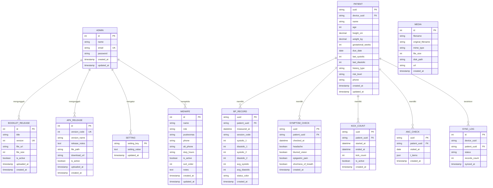

# DATABASE.md: ROTASI

## Entity Relationship Diagram



## Definisi Tabel

### ADMIN
Menyimpan akun administrator web.

| Kolom | Tipe | Constraint | Deskripsi |
|:---|:---|:---|:---|
| id | BIGINT | PK, AUTO_INCREMENT | Identitas unik |
| name | VARCHAR(255) | NOT NULL | Nama administrator |
| email | VARCHAR(255) | UK, NOT NULL | Email login |
| password | VARCHAR(255) | NOT NULL | Hash password (bcrypt) |
| created_at / updated_at | TIMESTAMP | DEFAULT NOW() / ON UPDATE | Waktu pembuatan & ubah |

### PATIENT
Profil ibu hamil yang tersinkron dari perangkat (FR-01, FR-02). UUID client-side sebagai kunci idempoten.

| Kolom | Tipe | Constraint | Deskripsi |
|:---|:---|:---|:---|
| uuid | CHAR(36) | PK | UUID client-side |
| device_uuid | CHAR(36) | NOT NULL | Perangkat asal |
| name | VARCHAR(100) | NOT NULL | Nama ibu |
| age | TINYINT UNSIGNED | NOT NULL | Usia (tahun) |
| height_cm | DECIMAL(5,1) | NOT NULL | Tinggi badan (cm) |
| weight_kg | DECIMAL(5,1) | NOT NULL | Berat badan (kg) |
| gestational_weeks | TINYINT UNSIGNED | NULLABLE | Usia kehamilan (minggu) |
| due_date | DATE | NULLABLE | Hari Perkiraan Lahir |
| last_systolic | SMALLINT | NULLABLE | Tensi terakhir (sistolik) |
| last_diastolic | SMALLINT | NULLABLE | Tensi terakhir (diastolik) |
| history_type | ENUM('none','hypertension','prior_preeclampsia','family') | NOT NULL | Riwayat hipertensi |
| risk_level | ENUM('low','medium','high') | NOT NULL | Hasil skrining otomatis |
| phone | VARCHAR(20) | NULLABLE | Nomor kontak |
| created_at / updated_at | TIMESTAMP | DEFAULT NOW() / ON UPDATE | Waktu pembuatan & ubah |

### BP_RECORD
Record hasil sesi pengukuran tekanan darah (FR-03, FR-04). Satu record = satu sesi (pagi/sore) berisi 2 pengukuran + rata-rata.

| Kolom | Tipe | Constraint | Deskripsi |
|:---|:---|:---|:---|
| uuid | CHAR(36) | PK | UUID client-side |
| patient_uuid | CHAR(36) | FK (PATIENT.uuid) | Pemilik |
| measured_at | DATETIME | NOT NULL | Waktu pengukuran |
| session_code | ENUM('pagi','sore') | NOT NULL | Sesi harian |
| systolic_1 / diastolic_1 | SMALLINT | NOT NULL | Pengukuran pertama |
| systolic_2 / diastolic_2 | SMALLINT | NOT NULL | Pengukuran kedua |
| avg_systolic / avg_diastolic | SMALLINT | NOT NULL | Rata-rata (basis klasifikasi) |
| status_color | ENUM('green','yellow','orange','red') | NOT NULL | Status roda ROTASI |
| created_at | TIMESTAMP | DEFAULT NOW() | Waktu tersinkron |

### SYMPTOM_CHECK
Ceklis gejala bahaya harian (FR-06).

| Kolom | Tipe | Constraint | Deskripsi |
|:---|:---|:---|:---|
| uuid | CHAR(36) | PK | UUID client-side |
| patient_uuid | CHAR(36) | FK (PATIENT.uuid) | Pemilik |
| checked_at | DATETIME | NOT NULL | Waktu pengisian |
| headache | BOOLEAN | DEFAULT 0 | Sakit kepala hebat |
| blurred_vision | BOOLEAN | DEFAULT 0 | Pandangan kabur |
| epigastric_pain | BOOLEAN | DEFAULT 0 | Nyeri ulu hati |
| shortness_of_breath | BOOLEAN | DEFAULT 0 | Sesak napas |
| created_at | TIMESTAMP | DEFAULT NOW() | Waktu tersinkron |

### KICK_COUNT
Hasil hitung gerakan janin (FR-07).

| Kolom | Tipe | Constraint | Deskripsi |
|:---|:---|:---|:---|
| uuid | CHAR(36) | PK | UUID client-side |
| patient_uuid | CHAR(36) | FK (PATIENT.uuid) | Pemilik |
| started_at | DATETIME | NOT NULL | Awal pengamatan |
| ended_at | DATETIME | NULLABLE | Akhir pengamatan |
| kick_count | SMALLINT | DEFAULT 0 | Jumlah gerakan |
| is_active | BOOLEAN | DEFAULT 0 | ≥3 gerakan/30 menit |
| created_at | TIMESTAMP | DEFAULT NOW() | Waktu tersinkron |

### ANC_CHECK
Ceklis kunjungan ANC standar 10T (FR-08). `t_items` JSON berisi boolean t1..t10.

| Kolom | Tipe | Constraint | Deskripsi |
|:---|:---|:---|:---|
| uuid | CHAR(36) | PK | UUID client-side |
| patient_uuid | CHAR(36) | FK (PATIENT.uuid) | Pemilik |
| visited_at | DATE | NOT NULL | Tanggal kunjungan |
| t_items | JSON | NOT NULL | Objek {t1..t10: boolean} |
| created_at | TIMESTAMP | DEFAULT NOW() | Waktu tersinkron |

### BOOKLET_RELEASE
Riwayat unggahan PDF booklet yang dikonsumsi aplikasi mobile; satu versi aktif pada satu waktu (FR-09, FR-18).

| Kolom | Tipe | Constraint | Deskripsi |
|:---|:---|:---|:---|
| id | BIGINT | PK, AUTO_INCREMENT | Identitas unik |
| title | VARCHAR(255) | NOT NULL | Judul booklet |
| version | INT | UK, NOT NULL | Versi unggahan (naik otomatis) |
| file_url | VARCHAR(500) | NOT NULL | URL PDF di object storage |
| file_size | INT | NOT NULL | Ukuran (bytes) |
| is_active | BOOLEAN | DEFAULT 0 | Versi aktif (maks 1) |
| uploaded_at | TIMESTAMP | DEFAULT NOW() | Waktu unggah |
| created_at | TIMESTAMP | DEFAULT NOW() | Waktu pembuatan |

### MEDIA
Metadata file gambar (ilustrasi) yang disimpan di object storage (S3-compatible).

| Kolom | Tipe | Constraint | Deskripsi |
|:---|:---|:---|:---|
| id | BIGINT | PK, AUTO_INCREMENT | Identitas unik |
| filename | VARCHAR(255) | NOT NULL | Nama file tersimpan |
| original_filename | VARCHAR(255) | NOT NULL | Nama asli |
| mime_type | VARCHAR(100) | NOT NULL | MIME (image/png, dsb.) |
| file_size | INT | NOT NULL | Ukuran (bytes) |
| disk_path | VARCHAR(255) | NOT NULL | Path/key objek di object storage |
| url | VARCHAR(255) | NOT NULL | URL publik |
| created_at | TIMESTAMP | DEFAULT NOW() | Waktu unggah |

### APK_RELEASE
Rilis versi aplikasi Android (FR-19).

| Kolom | Tipe | Constraint | Deskripsi |
|:---|:---|:---|:---|
| id | BIGINT | PK, AUTO_INCREMENT | Identitas unik |
| version_code | INT | UK, NOT NULL | Kode versi (naik monoton) |
| version_name | VARCHAR(50) | NOT NULL | Nama versi (mis. 1.0.0) |
| release_notes | TEXT | NULLABLE | Catatan rilis |
| file_path | VARCHAR(255) | NULLABLE | Path APK di server |
| download_url | VARCHAR(500) | NOT NULL | URL unduhan APK (disajikan langsung dari VPS) |
| is_active | BOOLEAN | DEFAULT 0 | Versi aktif (maks 1) |
| uploaded_at | TIMESTAMP | DEFAULT NOW() | Waktu unggah |
| created_at | TIMESTAMP | DEFAULT NOW() | Waktu pembuatan |

### SETTING
Pengaturan global key-value yang dikonsumsi aplikasi (FR-20).

| Kolom | Tipe | Constraint | Deskripsi |
|:---|:---|:---|:---|
| setting_key | VARCHAR(100) | PK | Kunci pengaturan (mis. `emergency_phone`, `puskesmas_name`) |
| setting_value | TEXT | NOT NULL | Nilai (JSON untuk data kompleks) |
| updated_at | TIMESTAMP | DEFAULT NOW() ON UPDATE | Waktu ubah |

> Catatan: nomor WhatsApp bidan **bukan** lagi bagian dari SETTING — bersumber dari tabel `MIDWIFE` (FR-22).

### MIDWIFE
Data bidan (kontak) yang dikelola admin web dan ditampilkan sebagai daftar kontak di aplikasi (FR-22).

| Kolom | Tipe | Constraint | Deskripsi |
|:---|:---|:---|:---|
| id | BIGINT | PK, AUTO_INCREMENT | Identitas unik |
| name | VARCHAR(150) | NOT NULL | Nama lengkap bidan |
| role | VARCHAR(100) | NULLABLE | Jabatan (mis. Bidan Koordinator, Bidan Pelaksana) |
| puskesmas | VARCHAR(150) | NULLABLE | Puskesmas/lokasi bertugas |
| phone | VARCHAR(30) | NOT NULL | Nomor WhatsApp (format internasional) |
| alt_phone | VARCHAR(30) | NULLABLE | Telepon alternatif |
| duty_hours | VARCHAR(150) | NULLABLE | Jam/periode bertugas |
| is_active | BOOLEAN | DEFAULT 1 | Aktif → tampil di aplikasi |
| sort_order | INT | DEFAULT 0 | Urutan tampil di aplikasi |
| notes | TEXT | NULLABLE | Catatan internal admin |
| created_at | TIMESTAMP | DEFAULT NOW() | Waktu pembuatan |
| updated_at | TIMESTAMP | DEFAULT NOW() ON UPDATE | Waktu ubah |

### SYNC_LOG
Log setiap sinkronisasi perangkat (FR-21).

| Kolom | Tipe | Constraint | Deskripsi |
|:---|:---|:---|:---|
| id | BIGINT | PK, AUTO_INCREMENT | Identitas unik |
| device_uuid | CHAR(36) | NOT NULL | Perangkat asal |
| patient_uuid | CHAR(36) | FK (PATIENT.uuid) | Pasien terkait |
| status | ENUM('success','failed') | NOT NULL | Hasil sinkronisasi |
| records_count | INT | DEFAULT 0 | Jumlah record diproses |
| synced_at | TIMESTAMP | DEFAULT NOW() | Waktu sinkronisasi |

---

## Skema Database Mobile (SQLite, di perangkat)

Aplikasi Flutter menggunakan **SQLite lokal** sebagai sumber data utama (offline-first). Skema berikut (dalam bentuk tabel drift/sqflite) mencerminkan struktur server namun menyimpan data mentah + status sinkron.

| Tabel Lokal | Kolom Utama | Keterangan |
|:---|:---|:---|
| `patient_profile` | id, patient_uuid, name, age, height_cm, weight_kg, gestational_weeks, due_date, last_systolic, last_diastolic, history_type, risk_level, phone, updated_at | 1 baris profil aktif |
| `bp_records` | uuid, measured_at, session_code, systolic_1, diastolic_1, systolic_2, diastolic_2, avg_systolic, avg_diastolic, status_color, sync_status | `sync_status`: pending/synced/failed |
| `symptom_checks` | uuid, checked_at, headache, blurred_vision, epigastric_pain, shortness_of_breath, sync_status | — |
| `kick_counts` | uuid, started_at, ended_at, kick_count, is_active, sync_status | — |
| `anc_checks` | uuid, visited_at, t_items (json), sync_status | — |
| `booklet_cache` | id, title, version, file_url, file_path, saved_at | Booklet PDF tersimpan (offline) |
| `midwives_cache` | id, name, role, phone, sort_order, saved_at | Cache daftar bidan aktif untuk hubungi bidan (FR-11) |
| `app_meta` | key, value | Versi booklet aktif terakhir, token device, pengaturan cached |

Kunci idempoten `uuid` dihasilkan client (UUID v4) dan menjadi kunci untuk menghindari duplikasi saat sinkronisasi ulang (FR-13).

## Skema Migrasi (Laravel)

Karena backend memakai Laravel, skema disediakan dalam bentuk migrasi (bukan Prisma). Contoh untuk tabel inti:

```php
Schema::create('bp_records', function (Blueprint $table) {
    $table->uuid('uuid')->primary();
    $table->foreignUuid('patient_uuid')->constrained('patients')->cascadeOnDelete();
    $table->dateTime('measured_at');
    $table->enum('session_code', ['pagi', 'sore']);
    $table->smallInteger('systolic_1');
    $table->smallInteger('diastolic_1');
    $table->smallInteger('systolic_2');
    $table->smallInteger('diastolic_2');
    $table->smallInteger('avg_systolic');
    $table->smallInteger('avg_diastolic');
    $table->enum('status_color', ['green', 'yellow', 'orange', 'red']);
    $table->timestamps();
});

Schema::create('booklet_releases', function (Blueprint $table) {
    $table->id();
    $table->string('title');
    $table->unsignedInteger('version')->unique();
    $table->string('file_url', 500);
    $table->unsignedInteger('file_size');
    $table->boolean('is_active')->default(false);
    $table->timestamp('uploaded_at')->useCurrent();
    $table->timestamps();
});

Schema::create('midwives', function (Blueprint $table) {
    $table->id();
    $table->string('name');
    $table->string('role')->nullable();
    $table->string('puskesmas')->nullable();
    $table->string('phone');
    $table->string('alt_phone')->nullable();
    $table->string('duty_hours')->nullable();
    $table->boolean('is_active')->default(true);
    $table->unsignedInteger('sort_order')->default(0);
    $table->text('notes')->nullable();
    $table->timestamps();
});
```

## Strategi Indexing

| Tabel | Kolom | Tipe | Tujuan |
|:---|:---|:---|:---|
| bp_records | (patient_uuid, measured_at) | Komposit | Ambil riwayat per pasien kronologis |
| bp_records | patient_uuid, status_color | Komposit | Statistik status warna per pasien |
| sync_logs | (patient_uuid, synced_at) | Komposit | Riwayat sinkronisasi per pasien |
| sync_logs | status | Tunggal | Filter log gagal |
| booklet_releases | is_active | Tunggal | Ambil versi booklet aktif |
| booklet_releases | version | Unique | Lookup cepat versi |
| patients | risk_level | Tunggal | Filter evaluasi riset |
| midwives | is_active, sort_order | Komposit | Ambil daftar bidan aktif terurut |

## Integritas Data & Constraint

- **Referensial:** Semua foreign key memakai CASCADE pada penghapusan entitas induk (PATIENT → BP_RECORD).
- **Unik:** `patients.uuid`, `booklet_releases.version`, `apk_releases.version_code`, `settings.setting_key` unik.
- **Idempoten:** Endpoint sinkron memakai `uuid` PK; record duplikat diabaikan (dicek berdasarkan uuid) sehingga sinkronisasi ulang aman (FR-13).
- **Enum:** `status_color`, `session_code`, `risk_level`, `history_type`, `sync_logs.status` dibatasi nilai terdefinisi.
- **Constraint aplikasi:** `apk_releases.is_active` dan `booklet_releases.is_active` hanya boleh satu bernilai 1 (partial unique / cek di lapisan aplikasi).
- **Validasi:** usia 12–55; IMT dihitung server & client; tekanan darah 50–180 mmHg (di luar rentang ditolak); nomor WA format internasional.

## Migrasi & Seeding

- Migrasi dikelola `php artisan migrate` (lihat DEPLOYMENT.md).
- Seeder menyediakan: akun admin awal, data bidan awal (nama & no WA dari bidan koordinator), dan pengaturan global default (ambulance, puskesmas, ambang rujukan). Booklet PDF diunggah manual melalui web admin (bukan seeder).

## Kinerja

- **Eager loading:** daftar pasien (admin) memakai `with('bpRecords')` ringkas untuk menghindari N+1.
- **Paginasi:** semua list memakai paginasi Laravel (offset).
- **Penyimpanan record:** BP_RECORD tumbuh ~60 baris/bulan/pasien (2 sesi × 30 hari); indeks komposit (patient_uuid, measured_at) menopang query riwayat tanpa masalah pada skala riset.
- **Cache:** metadata booklet & pengaturan global di-cache (opsional Redis) dan di-invalidasi saat unggah booklet/ubah pengaturan.

## Keamanan & Kepatuhan

- **SQL Injection:** seluruh query memakai Eloquent/query builder (parameterized).
- **Enkripsi:** password admin bcrypt; komunikasi TLS 1.2+; field `phone` diizinkan disimpan (minimasi), tidak ada data sensitif medis tambahan yang disimpan server selain yang diperlukan riset.
- **Minimasi data:** server menyimpan data yang dibutuhkan evaluasi riset; profil & record dapat dihapus (hard delete) atas permintaan peserta sesuai UU PDP.
- **Audit:** BOOKLET_RELEASE & SYNC_LOG memberi jejak audit riwayat unggahan booklet dan aktivitas sinkronisasi.
- **Akses:** kredensial DB terbatas pada user aplikasi (tanpa DROP/ALTER di produksi); akses admin dibatasi sesi + rate limit login.
